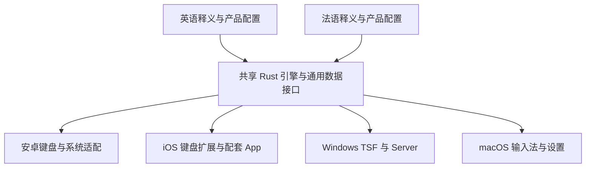

# 英语与法语伴学输入法技术方案

最新状态（2026-10-05）：Windows demo.2 已完成法语高频补词、55 条中文日用词读音和简洁候选/设置外观，回归与 Defender 扫描通过。当前记录见本文件末尾的 demo.2 章节；前文旧版状态保留作历史。

2026-10-04 Windows 首轮已实现：平台无关英法词义集中在 upstream/crates/ciban-lexicon，Android 模块保留兼容导出；桌面 Router 使用同一读音标注与短译文函数。最小调整沿用 Cargo 工作区，未建立另一份 shared 工程。products/windows.json 为双包标识真源，platform/build.rs 生成注册/pipe/目录常量；pipe 附登录会话编号并核验客户端会话，拒绝远程客户端。WinUI 设置/TSF/Server/标准 Inno 构建分别指定 CIBAN_PRODUCT；同机独立词义、配置及学习目录。当前交付 Windows 11 x64 demo，含 x86 DLL；云预测、输入日志、上游更新检查关闭，uiAccess=false。首轮中文候选与快捷译词提交已回归，桌面详情尚未接入。构建与安全约束见 ../desktop/windows/BUILD.md，实际验收边界见 ../deliverables/Windows验收记录.md。

PC 路线已按锁定源码审计具体化（2026-10-04）：见 [PC_DELIVERY_PLAN.md](PC_DELIVERY_PLAN.md)。Windows 11 x64 优先，沿用上游 TSF + Server + WinUI + Inno，保留 32 位宿主所需的 x86 TSF DLL。一套工程构建英语/法语两个独立安装器；提前隔离身份与 IPC，再打通英语、同轮接入法语。将 mobile/native 中读音词义与标注提取为平台无关共享模块，数据生成与 Android 资源布局解耦。默认关闭输入内容日志、云预测和上游更新检查。当前只完成源码与元数据审计，未验证 Windows 编译/安装；uiAccess/签名、旧 DLL 升级兼容与实际应用验收为交付门槛。

官网下载扩展（2026-10-04 最新一次性规则）：原有 `maxnote.top` 的 HTTPS、独立 `/ciban/` 路径，Node.js 单一服务监听 `127.0.0.1:3081`；原教育站点 3000 端口与代码不改。每个码仅可领取英法中的一个 APK，校验与 HEAD 不核销，有效 APK GET 发送响应前以串行队列 + fsync + 原子替换将核销写入 `/var/lib/ciban-download/redemptions.json`。原 100 个码哈希与编号保留，明文仅在本地。Cookie HttpOnly/Secure/SameSite=Strict，原领取者续传凭据只保存哈希，可在重启后恢复；未完成、同一浏览器、同一版本、30 分钟内仅 Range 续传，完成后禁止重下。生产账本必须存在且合法，损坏 / 缺失时拒绝启动，不重置已用码；服务只允许写持久状态目录，代码 / APK 只读。源码独立授权不占 APK 次数，已用码仍可获取配套源码。停用恢复只改手动停用标志，不清除核销记录。更新发布与备份均需保留账本及码表当前状态，禁止多进程并写。见 [下载官网](DOWNLOAD_WEBSITE.md) 与 `website/README.md`。

0.5 扩展：九宫格主键仅显示字母组（ABC/DEF/GHI/JKL/MNO/PQRS/TUV/WXYZ，24sp），内部数字编码与无障碍键位编号保留，标点和数字模式独立。KeyboardView 候选卡按位置复用，默认绑定前八项，横滑到末端前继续绑定八项，展开时才建立完整列表；按下时捕获候选与 revision，视图重绑定不能改变已经触摸的身份。旧 revision 由原协议拒绝，避免快输入误选。T9Index 启动时生成合法末音节补全的前缀表、缓存音节数字编码；不降低 beam 或候选上限。译词在八条路径候选合并去重后统一注释，查询排序不依赖译词。实际随包词典 1,522 个前缀/选音样本与冻结 0.4 解码路径、分数、选音完全一致；不是全量组合穷举。

Debug 包提供仅显式 `ciban-perf=true` 触发的 KeyboardBenchmark，使用自己试打页固定输入、private reset，不读取其他应用。记录 performClick 到匹配状态首次 onDraw（含输入队列、JNI、JSON、编辑器、候选绑定与首帧），另外测 JNI；排除物理触摸和显示扫描。初始化后丢弃两轮热身、UI 276 样本、JNI 460 样本、十键突发检查。真实系统 IME 功能另做触摸回归；不能将试打页性能等同所有宿主性能。当前没有新增网络权限和翻译服务。

0.4 扩展：英语加入 EnglishLexicon，读音表使用同样的“词头#无声调拼音”键。已整理义项覆盖上游释义，未整理多读音保护记录阻止词头通用释义，其他词保留上游译文和词性。英语 detail 可展示已知的原形、可数性、词形、例句与语境说明；缺字段不补造。英语新增表纳入内容哈希，沿用原子安装与学习数据迁移。键盘高度由共用 settings/t9-height 控制，默认舒适；系统 IME 视图签名含高度与方向，重新显示时更新。横屏候选与拼音栏并列，主行高限制 54dp。已启用产品打开 MainActivity 时优先显示试打输入框。

更新日期：2026 年 10 月 4 日。方案状态：已完成安卓 demo 编译、模拟器验证和真机有限输入验证，全面兼容与正式产品验收待后续。用户需求与实际进度以 [项目进度](PROJECT_PROGRESS.md) 为准。

本方案用于减少双包和跨平台重复开发。已实现 Rust 路径依赖 + JNI + Kotlin InputMethodService，共用一份源码、两个 product flavor。Android 0.2 新增九宫格，并在用户 Android 12 ARM64 手机测试；实际构建见 BUILD.md。PC 与苹果方案仍属后续设计，不能把安卓 demo 的完成推定为其他平台完成。

## 系统边界

共享层负责中文解析、查询、排序、释义和通用学习逻辑。平台层负责触摸或键盘事件、输入框提交、界面、文件位置、系统权限和生命周期。[上游架构](https://github.com/qingjian-team/qingjian/blob/main/docs/design/architecture.md)

界面共享设计规范和产品行为，不要求所有平台使用同一份 UI 代码。移动端需要触摸键盘，桌面端主要是实体键盘配候选窗口。原生界面选择以手感、维护成本和性能验证为依据。

## 代码与上游管理

在本项目中维护一个开发真源和最小必要的上游修改。准备阶段先下载独立源码目录，保存上游提交与许可证清单；尊重该目录内的开发约定。不要复制英语版源码成法语版，也不要由安卓工程产生另一份输入引擎。

目录确定为 `upstream/` 固定源、`mobile/native/` Rust JNI 桥接工作区、`mobile/android/` Kotlin 原生客户端、`data/` 法语样例、`scripts/` 构建验证、`deliverables/` 双包与验收证据。独立 Rust 工作区通过路径依赖复用上游核心，避免桌面、神经模型与 TLS 依赖进入安卓构建。上游修改集中于法语支持，依赖兼容调整另外记录。

上游同步必须在本地双产品回归验证后采用，不让 main 的未验证变动直接进入发布。共享核心、数据格式、平台客户端分别记录版本和兼容范围。

## 双产品配置

统一产品配置至少包含产品标识、目标学习语言、名称、图标、配色、随包数据和数据版本。目标学习语言与实际输入语言分开表达：当前两个产品主要输入中文，候选旁分别显示英语或法语，不能把伴学语言误当成系统键盘的主要输入语言。

Android 采用构建变体区分两个产品，共用核心和键盘实现，分别生成独立应用标识和包。每包只带当前需要的目标语言数据及共用中文数据，不通过两份重复源码实现。[安卓构建变体](https://developer.android.com/build/build-variants)

| 平台 | 产品需要隔离的内容 |
| --- | --- |
| Android | 应用标识、名称、图标、Manifest 相关标识、私有数据和升级记录 |
| Windows | TSF COM 与配置文件标识、服务启动、IPC 管道与互斥量、安装路径、数据路径、卸载与更新 |
| macOS | Bundle 标识、输入源标识、名称、数据路径与更新渠道 |
| iOS | 配套 App 与键盘扩展的 Bundle 标识、适用时的共享容器、产品配置和数据；双 App 发行需另外验证 |

Windows 两包不可只替换名称与词库。相同的 TSF 注册或 IPC 标识会导致覆盖、连错服务等问题，必须真实测试并存和卸载。

## 安卓最小实现

已采用 Kotlin 原生 View、`InputMethodService` 与 JNI。Rust 线程内会话表持有引擎，Kotlin 单线程执行器创建、调用和销毁句柄。返回 JSON 含候选、revision、组合文本及提交/删除结果；旧输入框回调按代次屏蔽，过期候选 revision 拒绝提交。[安卓输入法 API](https://developer.android.com/develop/ui/views/touch-and-input/creating-input-method)、[JNI 文档](https://developer.android.com/ndk/guides/jni-tips)

最小桥接能力包含引擎创建与销毁、输入更新与查询、候选提交、删除与重置、语言装配和持久化调用。真实函数签名以锁定版本的核心 API 为准，不能将这里的职责名称视为上游已存在的函数。

输入状态尽量由 Rust 核心统一管理。平台维护输入框会话、触摸与展示状态，明确跨接口内存所有权和线程边界。异步查询或模型结果必须绑定会话和请求代次，旧结果不能覆盖新输入；候选点击绑定候选身份与当前状态，避免刷新后提交错词。

平台负责正确使用组合文本和提交接口，处理光标变化、输入框切换、数字与网址场景、敏感输入、后台恢复和数据落盘。核心原有能力仍需经过安卓事件序列验证。[输入法交互与提交说明](https://developer.android.com/develop/ui/views/touch-and-input/creating-input-method)

首个验证仅引入完成离线拼音与译词所必需的依赖。神经模型和云联想分别建立后续验证，不让可选功能阻塞最小闭环；移除某个功能时必须记录对输入质量的影响。

## 英语与法语数据

英语优先复用上游随包释义，核对实际数据版本、内容与许可。法语增加语言代码、配置解析、释义文件装配、数据工具和样例测试；若接入词汇记录、云兜底或等级统计，也检查对应语言分支。

首轮增加 French 枚举、配置解析与 372 条 AI 示例。0.3 在桥接层新增 FrenchLexicon：以“中文词头#无声调拼音”查询独立的基础词典和常用学习记录，常用记录优先；保持上游 Translation 最多两条短释义，完整义项和学习信息另通过候选 detail 返回。English 不加载法语表。基础词典 CC BY-SA 3.0，项目独立 AI 整理 GPL-3.0-or-later，分表打包，不混改许可。UTF-8 重音与缺译词仍按原行为处理。

语言数据记录来源、许可、版本、生成方式、审核状态与覆盖情况。可沿用上游 LLM 离线生成流程，但机器结果不视为校对完成。优先直接按中文词义生成法语，避免无依据经英文再译造成歧义叠加。

法语检查重音与 Unicode 文本、大小写、动词原形、名词阴阳性、多义词和短语长度。基础阴阳性可以先作为显示文本表达；若以后要结构化检索和筛选，再升级数据结构并做迁移。词级译词不能承诺与每个中文句子的语境一致。

0.3 已接入派生数据：55,461 条基础读音记录、558 条学习读音记录（529 个词/短语），真实 mmap 审计匹配中文库 34,548 个词。长按详情内展示完整义项、已知词性、性别、原形与使用说明；不为基础词典未知字段自动编造语法信息。单一无声调拼音仍无法区别同音不同调、句子语义。独立编辑审核未完成，静态高频前五千也未全部覆盖；剩余审核队列与来源见 FRENCH_DICTIONARY_PLAN.md。

等级统计需要适合法语且许可清楚的资料，不能直接把现有英文等级表套给法语。未接入可靠资料时，先提供不分级的词汇记录。

共用 `.qj` 等上游数据机制时验证格式和平台兼容性。词库可首次从资源复制到私有文件位置再加载，确保文件映射与权限正确；更新采用完整替换和原子落盘，防止使用中覆盖已映射文件。

0.3 随数据内容 SHA-256 生成 cache-version.txt；按产品私有目录 `engine-v2-<16位内容哈希>` 安装不可变资源，禁止原位覆盖运行中的 mmap。首次升级从记录的前一目录迁移 frequency.tsv、user-choices.tsv、user-ngram.tsv，以迁移标记避免恢复已清理的数据；旧版本回退入口为 engine-v1。布局/主题偏好保留。手机升级检查比较学习文件前后哈希和新词库内容哈希，不读取私人文本用于报告。

## 交互与 UI 方案

用户明确要求新增九宫格，Android 0.2 已实现。外层 Rust `T9Index` 从 mmap 词库建立数字编码与读音索引；使用词路径搜索，最多 8 条解析、最后音节可补全，每段最多 32 数字键。解析后交给上游 Engine 查询、标注和提交，桥接负责跨读音的候选合并与完整覆盖优先。音节选择绑定 revision，选定音节约束解码及候选，提交按候选音节消耗数字编码；前缀提交保留剩余部分。

九宫格不是上游已经存在的解析器，也不声称复用上游原封不动的跨读音排序。当前实现不含九宫格简拼专用算法，复杂长句和个性化连续上下文需专项验证；固定 beam 可能漏掉低分路径。UI 提供全键/九宫切换和产品独立记忆、横滑音节、分词/重选，字母/密码/数字模式保持相应直接输入。回车原文提交数字编码，切回全键盘使用当前解析拼音。详见九宫格验收记录和剩余开发清单。

先设计普通候选、长译词、缺少释义、展开候选、中英切换、数字标点、按下与长按、键盘收起恢复这些真实状态。首轮同时使用英语和法语内容，不在英语界面完成后才测试法文。

候选以中文为主、译词为辅，保证字号和对比度。固定候选栏的基础高度，展开查看长内容，明确候选横滑与点击的区别。常用键位置保持熟悉，删除和语言切换不易误触；调整点击区域时以真实手机的输入错误为依据。

设置和启用引导使用任务语言：启用、切换、试打、查看设置。按键反馈即时，震动可关闭；候选生成不能等待学习动画或网络。桌面端沿用相同产品行为，结合实体键盘快捷操作设计。

通过设计稿、可操作原型和最终真机截图逐步验证，检查深浅色、大字体、横屏、屏幕边缘、安全区、长词截断和无障碍描述。UI 水平以实际可读性、误触率和使用反馈评估。

## iOS 前置验证

iOS 使用独立键盘扩展与配套 App，推荐原生实现键盘界面和系统调用，共用 Rust 引擎。Rust 支持 iOS 编译，但仍需 Xcode SDK 和真实扩展测试，不能把 macOS 平台适配原样打包到 iPhone。[Rust iOS 支持](https://doc.rust-lang.org/rustc/platform-support/apple-ios.html)

先验证最小候选引擎、离线数据读取、内存与启动表现、进程回收后恢复、上屏删除和键盘切换。键盘需要在没有完全访问权限时支持基本输入；密码输入和禁用第三方键盘的应用不承诺可用。[苹果键盘说明](https://developer.apple.com/library/archive/documentation/General/Conceptual/ExtensibilityPG/CustomKeyboard.html)、[审核规则](https://developer.apple.com/app-store/review/guidelines/#extensions)

同时核实 GPL 与实际 App Store 分发条件，检查所有相关代码和依赖的权利范围。需要例外许可时必须取得相应权利人的许可，不能自行给他人的代码加例外。[许可例外实践](https://github.com/nextcloud/ios/blob/master/COPYING.iOS)

英语与法语双产品保留独立配置，但 iOS 仅更换数据的两款 App 可能涉及审核规则 4.3；这是待验证风险。若最终发行需要改变产品形态，应向用户提供具体方案和理由，不能未经用户确认就改成一个产品。[重复应用规则](https://developer.apple.com/app-store/review/guidelines/#spam)

## 验证与交付

| 验证范围 | 证据 |
| --- | --- |
| 核心逻辑 | 固定输入序列，查询、提交、删除、学习和异常状态的回归测试 |
| 桥接 | 生命周期、字符串编码、内存所有权、错误返回和并发边界 |
| 应用输入 | 微信、浏览器、笔记、搜索及数字、网址、敏感输入的真机步骤 |
| 双包 | 同机安装、切换、数据隔离、升级和卸载；Windows 增加注册与 IPC 验证 |
| 性能 | 固定设备 release 包的输入延迟分布、冷启动、内存和耗电基线 |
| 数据 | 高频和歧义样例检查、错译修正、覆盖统计、缺释义行为 |
| UI | 截图与录屏、尺寸与主题检查、目标用户试打反馈 |
| 发布 | 安装内容、数据版本与许可、源码对应关系、签名和实际升级验证 |

自动构建先覆盖有真实代码的阶段。最小 APK 建立后再引入双产品构建、核心测试和必要的 UI 测试；测试应覆盖实际失效风险，不为进度文档或静态样式增加无意义测试。

每个里程碑交付可以检查的结果，例如 APK、运行记录、截图与测试结论；缺少真机时明确记录未验证的范围。性能预算按固定场景测量，不用未知设备的数字承诺所有手机表现。

## 现在开始的工作

第一轮移植已完成。下一步以用户手机试用反馈驱动输入体验和兼容修正，建立真机速度、内存及耗电基线；法语继续扩充并校审。跨平台保留共享核心与独立产品配置，按 Windows 双包隔离和 iOS 原型/发行验证的既有路线推进，不让账号云服务扩展阻塞基本输入质量。
## 2026-10-05：Windows 0.1.0-demo.2 法语补词与简洁外观

用户反馈常用词缺少法语、桌面 UI 过于原始，并要求尽量贴近微信输入法的简洁效果。本轮沿用原生 TSF/WinUI，保留词伴身份，改进候选和设置首页，不使用微信名称、图标或素材。

- 补充 877 条有效法语读音记录，静态前千词覆盖 974/1000、前五千词 4566/5000（91.32%），相对上一版前五千增加 644 个词头；原始 91,919 词头中匹配 35,235 个。新增 55 条中文日用词读音，使“保鲜膜”等原先不在中文词库的词可以成为候选。原始中文词条、读音、频率完整保留；新增频率 1000 为项目默认值，非实测频率。
- 瓶盖 le bouchon、平菇 le pleurote、保鲜膜 le film alimentaire、充电宝 la batterie externe 等通过实际随包 mmap 和后台输入/提交验证。词库补充由 AI 草拟、自查，尚未经过独立法语编辑审核；语境片段加注说明，地名及其余 434 个前五千缺词保留待审，不强行机械翻译。
- 候选默认五行、浅色背景、细边框、柔和阴影、清晰绿色选中标记；调整字号和间距。每行显示首个常用义，过长时省略，完整译词及第二义快捷提交保留。设置首页突出启用和试打，其他偏好收进展开区。
- 新安装采用简洁默认值；升级保留用户原有配置，设置首页“使用简洁浅色外观”按钮可应用浅色五行。深色仍可选。
- 两语言各 74 项 Rust 单元测试通过，安卓核心 10 项通过、1 项忽略。真实随包后台使用隔离测试管道，并核验连接进程 PID，避免误连已安装旧版本。实际 x64 TSF COM factory、候选、译词提交与取消回归通过；离线 PNG 使用实际输入帧和候选转换器。
- Computer Use 的设置窗口访问审批超时，没有绕过访问限制；渲染图不是系统截图，设置首页实屏、实际安装升级、跨应用输入、32 位宿主及多屏/DPI仍待验收。本轮没有重建 Android APK，官网与一次性下载码不变。

详细记录见 [新版验收记录](../deliverables/Windows法语补词与UI验收记录.md)，测试入口见 [新版测试说明](../deliverables/Windows测试说明-v2.md)。
